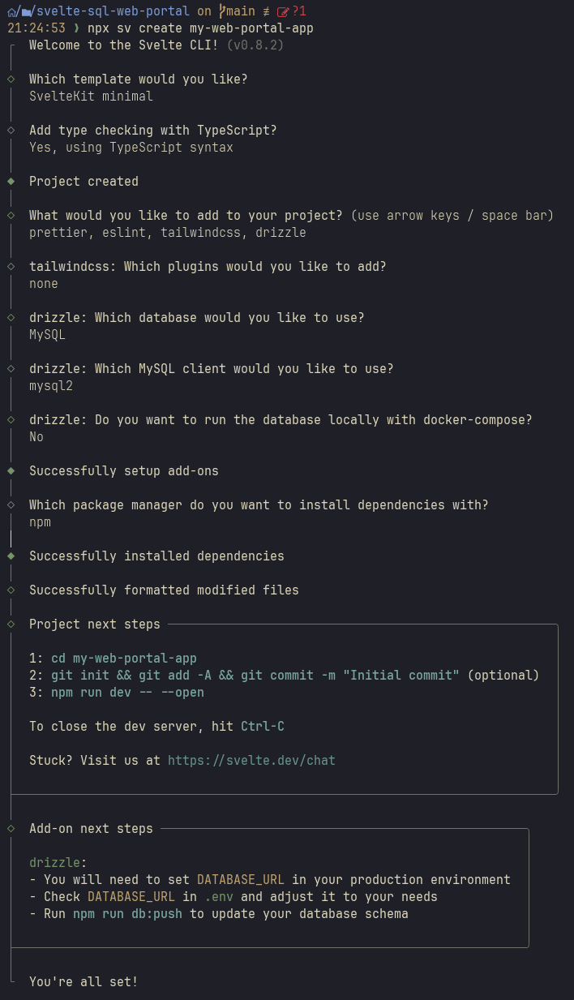
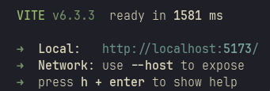
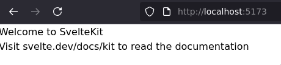
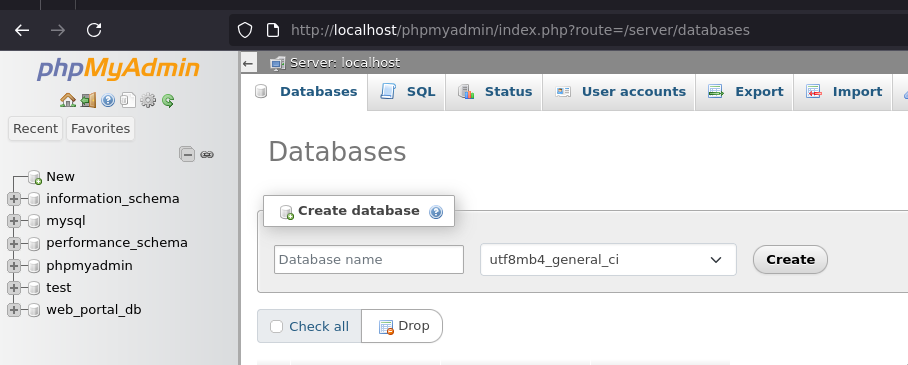
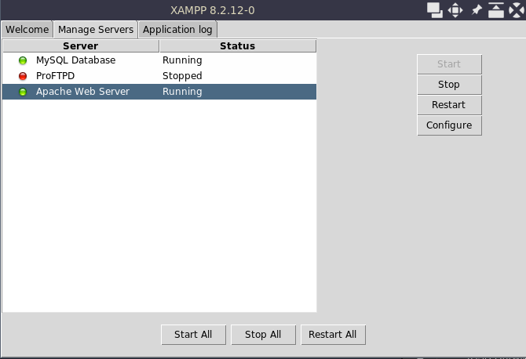
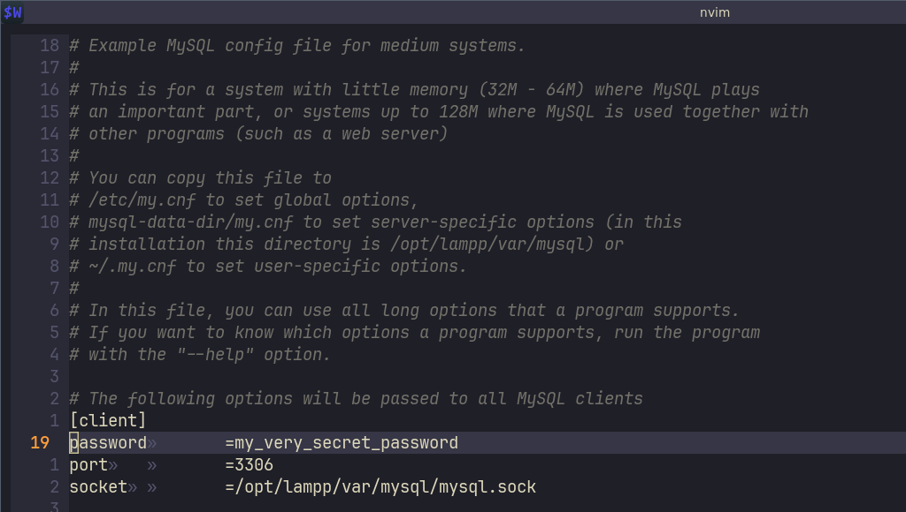

# 0. Setup

In this chapter, we provide guidance on setting up a development environment so we can start developing the web app.
## Goal

By the end of this chapter, we will have accomplished the following:
- (Setup our WSL environment)
- Created a new SvelteKit project
- Installed the dependencies for our SvelteKit project
- Started a MySQL server using XAMPP
- Created a new database through PHPMyAdmin
- Set up our code editor for development
## Requirements to follow along

- A system running a Debian/Ubuntu-based distro
	- This setup was tested on Linux Mint 21.3, but generally speaking, any Debian/Ubuntu-based distro should be fine.
    - Do you have a Windows system? In that case you can use [WSL](https://docs.microsoft.com/en-us/windows/wsl/install) 
	    - When we mention any other software requirements, we assume you have set up that software in the WSL distro, unless otherwise specified.
- Git and a Github account
- Node.js and npm
    - See [Nodejs.org](https://nodejs.org/en/download/) for the latest installation instructions.
- A MySQL database
    - For simplicity, we will host a local MySQL database with [XAMPP  for Linux](https://www.apachefriends.org/).
        - Windows/WSL users can opt to use XAMPP for Windows and host the database on the Windows side of things instead.
    - Don't worry, we'll set up this database later in [[#0.2 - The Database]]

We'll need to do some setup for the web portal, and the database, separately.

## 0.0 - Help for first time Windows/WSL users

You can skip this part if you feel comfortable using WSL.

This won't be a full-blown tutorial on how to use Unix systems, but serves as a quick-start guide to get to a point where you can follow along with this tutorial from a fresh WSL install.

1. After downloading WSL and running it for the first time, you will be asked to set a username and password. 

2. The very next thing you want to do is run
	```bash
	sudo apt-get update
	```
	To update the package registry, and 
	```bash
	sudo apt-get upgrade
	```
	To upgrade the packages on your system.

3. Next, let's get `git` working.
   Download it with `sudo apt-get install git`
	- Follow the instructions on [this page](https://docs.github.com/en/authentication/connecting-to-github-with-ssh/generating-a-new-ssh-key-and-adding-it-to-the-ssh-agent?platform=linux) for setting up SSH auth to your github account.
	- Don't forget to setup `git config --global user.name "Your Name"` and `git config --global user.email "your@email.com"`
4. Next, follow the instructions [here](https://nodejs.org/en/download/) to setup Node.js and npm

You should now be ready to move on to [[#0.1 - The web portal]]

## 0.1 - The web portal

- First, let's create a new [SvelteKit](https://svelte.dev/docs/kit/creating-a-project) app.
```bash
# Let's create a directory to work in and navigate into it
mkdir -p ~/work
cd ~/work
# 

# Create the project.
npx sv create my-web-portal-app
```

After running the above command, you'll be met with
a CLI, in which you should select the following options:
- Template: SvelteKit minimal
- TypeScript: Yes, using TypeScript syntax
- Plugins: Prettier, eslint, tailwindcss, drizzle
- Tailwindcss plugins: None
- Drizzle database: MySQL
- Drizzle client: mysql2
- Run database locally with docker-compose: No
- Package manager to install dependencies: npm

To explain the above options:
- **Template**: We want to use the minimal template, as we will be adding our own components and styles later on.
- **TypeScript**: We will be using TypeScript for this project, as it is a great way to catch errors early on in the development process.
- **Plugins**: We will be using [Prettier](https://prettier.io/) (an opinionated code formatter), [eslint](https://eslint.org/) (a static code analysis tool), [tailwindcss](https://tailwindcss.com/) (a CSS framework), and [drizzle](https://orm.drizzle.team/docs/overview) (a Typescript ORM)  for this project. Prettier and ESlint make sure our code is formatted correctly and follows best practices, TailwindCSS is a CSS framework that allows us to write CSS in a more efficient way, and Drizzle is an Object Relational Mapper (ORM) that allows us to interact with our database in a more efficient way. 
- **Tailwindcss plugins**: We will not be using any TailwindCSS plugins for this project.
- **Drizzle database**: We will be using MySQL as our database for this project.
- **Drizzle client**: We will be using the mysql2 client for Drizzle, as it is a popular client for MySQL.
- **Run database locally with docker-compose**: We will not be using Docker for this project, as we're running a local MySQL server with XAMPP.
- **Package manager to install dependencies**: We will be using npm to install our dependencies, as it is a popular package manager for Node.js.

You  should see something like this:


Hurray! The project is created.
It now lives at `~/work/my-web-portal-app`

Now let's go there so we can install the dependencies using `npm`:
```bash
# Change working directory into the project
cd my-web-portal-app
# Install the dependencies
npm install
```

Now confirm that our web app is now working by running 
```bash
npm run dev
```

You should see your web app is now live at [http://localhost:5173](http://localhost:5173).


Take a look and we should be met with SvelteKit's default page:


You can close the server by hitting CTRL+C in the terminal.

Now that we know our web app is working, let's commit what we have.

```bash
git init
git add .
git commit -m "Create SvelteKit project"
git push
```


That's it on the web app side of things for now. Let's move on to setting up the Database server before we do anything else.

## 0.2 - The Database

### Windows

If you feel comfortable enough running LAMPP on WSL instead, do that, and skip over to [[#Linux (Ubuntu/Debian)]].

If you don't, I recommend you try to follow those instructions anyway so you can get more comfortable with the Unix side of things. 

However, it can also be wise to just opt to run XAMPP on Windows for now, and figure LAMPP out later. In that case, follow these instructions:
1. Download and install [XAMPP](https://www.apachefriends.org/index.html) for Windows.
2. Launch the XAMPP Control Panel
3. Start a MySQL server and the Apache web server
    - This gives us access to our database through PHPMyAdmin's web interface. 
4. Create a new Database in PHPMyAdmin (http://localhost/phpmyadmin). I'll name it `web_portal_db`.
   
5. Optionally, set a password on the MySQL server (In the 'User Accounts' section of PHPMyAdmin). Remember to restart the MySQL server afterwards.

### Linux (Ubuntu/Debian)

1. Download LAMPP
	1. First let's go back to our workspace:
	   ```bash
	   cd ~/work
	   ```
	2. Go to [Apache Friends](https://www.apachefriends.org/index.html) and copy the link to download 'XAMPP for Linux'. The latest version should be just fine.
	3. Download the xampp installer:
	   ```bash
	   wget -O xampp-installer.run <copied link>
	   ```
		in my case:
		```bash
		wget -O xampp-installer.run https://sourceforge.net/projects/xampp/files/XAMPP%20Linux/8.2.12/xampp-linux-x64-8.2.12-0-installer.run
		```
	4. Make the installer executable:
	   ```bash
		sudo chmod +x xampp-installer.run
		```
	5. Run the installer:
	   ```bash
		sudo ./xampp-installer.run
		```
	6. Success? Don't forget to remove it
	   ```bash
	   rm ./xampp-installer.run
	   ```
2. Navigate to LAMPP's installation directory 
   ```bash
	cd /opt/lampp
	```
3. You now have two options:
	1. Start the servers through the manager
		1.  Run the manager
			```bash
			sudo ./manager-linux-x64.run
			```

		2.  Start the MySQL server 
		   
		3. Start the Apache web server - this gives us access to our database through PHPMyAdmin's web interface.
	2. Start all servers through a command instead (mind that this will also start the ProFTPD server, but that doesn't really matter for now)
	   ```bash
	   sudo /opt/lampp/lampp start
		```
4.  Create a new Database in PHPMyAdmin (http://localhost/phpmyadmin). I'll name it `web_portal_db`.
   
5. Optionally, set a password for your database through PHPMyAdmin User Accounts, or in `/opt/lampp/var/mysql/my.cnf` by uncommenting and changing the highlighted line. Don't forget to restart your server afterwards.
   This is best done using your favourite terminal-based text editor, such as `nano` or `nvim`.
   

## 0.3 - Code Editor

Now that we have our web app and database set up, let's set up our code editor.

1. Open your code editor of choice. I'll cover instructions for [Neovim](https://neovim.io/) and [VSCode].
2. Install extensions for Prettier, ESLint, TailwindCSS, Svelte, and TypeScript.
    - VSCode:
        - Open up the Extensions tab, search for the extensions, and install them.
    - Neovim:
        - [Kickstart.nvim](https://github.com/nvim-lua/kickstart.nvim) is a great starting point for setting up Neovim with LSP support.
        - Run :Mason and install 
            - tailwindcss-language-server
            - eslint-lsp
            - prettier
            - svelte-language-server
            - typescript-language-server
3. Verify that your editor is working properly by opening up `src/routes/+page.svelte` and checking that the syntax highlighting works.
    - ℹ️ Windows/WSL Users: Remember that you can find your project at `\\wsl$\Ubuntu\home\<your-username>\work\my-web-portal-app\` in Windows Explorer.

## 0.4 - Rounding Up

We have accomplished the following:
- (Setup our WSL environment)
- Created a new SvelteKit project
- Installed the dependencies for our SvelteKit project
- Started a MySQL server using XAMPP
- Created a new database through PHPMyAdmin

We can now start the actual development of the web portal app. 
Next up: [the site skeleton](../1-svelte-site-skeleton/1-svelte-site-skeleton.md).
