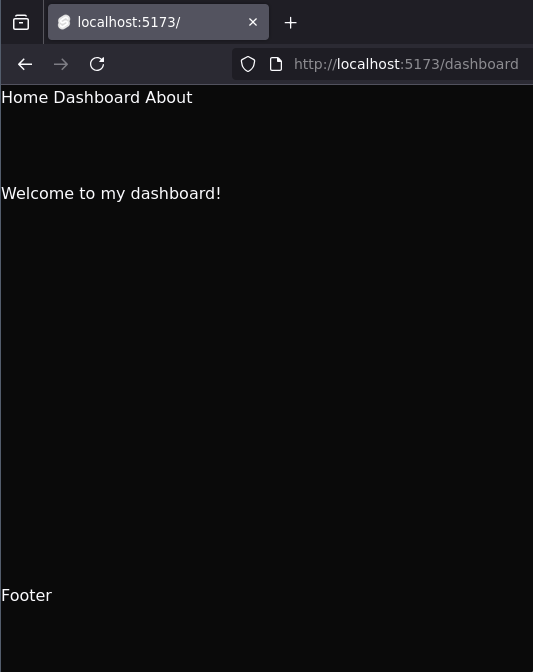

In this chapter, we set up the site skeleton for our web portal.
# 1. Site Skeleton using SvelteKit
## Goals
By the end of this chapter, we will have:
- Learned about SvelteKit and Svelte.
    - We will have learned about the `src/app.html` and `src/app.css` files, and how SvelteKit uses them to render our pages.
    - We will have learned about the `+layout.svelte` and `+page.svelte` files, and how SvelteKit uses them to render our pages.
    - We will have learned about navigation in SvelteKit using the `goto` function from `$app/navigation`.
    - We will have used an `each` block to iterate over arrays.
    - We will have learned about the `on:click` event handler in Svelte, and how to use it to handle events.
- Installed [Skeleton](https://www.skeleton.dev/), a opiniated solution for generating adaptive design systems.
- Created a basic HTML structure for the web portal using Skeleton components.
    - The structure includes:
        - A header containing a...
            - ...logo
            - ...navigation menu
            - ...dark mode toggle
        - A main content area
        - A footer
- Set up navigation between the three pages of the web portal.
    - Our website will have three pages for now: a...
        - ...home page
        - ...dashboard page
        - ...about page
- Added a dark and light mode to our project

## 1.0 - SvelteKit

SvelteKit is a framework for building web applications using Svelte. It provides a powerful set of tools and conventions for building modern web applications, including routing, server-side rendering, and static site generation.
SvelteKit is designed to be easy to use and flexible, allowing developers to build applications quickly and efficiently. It also has a strong focus on performance, making it a great choice for building fast and responsive web applications.
This tutorial won't go in-depth on explaining how Svelte and SvelteKit works, but instead focuses on the steps we have to take to build an application using it.
You should check out the [Svelte welcome page](https://svelte.dev/docs/kit/introduction) to get acquainted with Svelte.

Their website also features [a great interactive tutorial](https://svelte.dev/tutorial/svelte/welcome-to-svelte) that will help you understand the basics of Svelte.
**You should complete at least the `Basic Svelte > Introduction`, `Basic SvelteKit > Introduction`, and `Basic SvelteKit > Routing` tutorials before continuing with this chapter.**

Now let's take a look at our SvelteKit project.
Take note of the files in the `src` folder and find out about their purpose using [this page](https://svelte.dev/docs/kit/project-structure#Project-files-src).

For now, we should know about these three files: The `src/app.html` file provides a template for the site structure, and has placeholders that SvelteKit will slot in. For example, we can see that the content that the website currently renders in the `%sveltekit.body%` placeholder is listed in `src/routes/+page.svelte`.
The content of the `src/routes/+page.svelte` is slotted in the `{@render children()}` of `src/routes/+layout.svelte`. 

Great, now that we have a basic understanding of developing with Svelte, let's set up one more dependency: Skeleton.

## 1.1 - Install Skeleton

Skeleton is a design system that provides a set of components and styles for building modern web applications. It is built on top of Svelte and provides a powerful set of tools for building adaptive design systems.
We will use Skeleton components to create a basic HTML skeleton (let's not confuse the two skeletons here!) for our web portal, which will include a header, main content area, and footer. Skeleton also provides a set of components for building navigation menus, buttons, and other UI elements.

Install Skeleton using the latest instructions from [the documentation page](https://www.skeleton.dev/docs/get-started/installation/sveltekit).
We will list the instructions here for reference, but they may change in the future.

```bash
npm i -D @skeletonlabs/skeleton @skeletonlabs/skeleton-svelte
```

Update `src/app.css`:

```bash
@import 'tailwindcss';

@import '@skeletonlabs/skeleton';
@import '@skeletonlabs/skeleton/optional/presets';
@import '@skeletonlabs/skeleton/themes/cerberus';

@source '../node_modules/@skeletonlabs/skeleton-svelte/dist';
```

Update the `html` attribute in `src/app.html` to set the theme to a theme of your liking:

`src/app.html`:
```html
<html data-theme="vintage">...</html>
```

Now we reload the svelte project (run `npm run dev`), and will notice that the website's theme has updated!

## 1.1 - The Layout

The layout will feature a simple top-to-bottom structure: a navigation bar of fixed height on top of the page, a footer at the bottom of the page, and main content in between.

Let's achieve that look! `src/app.html` provides a page template, which Svelte will slot components and other markup into. For our layout, we need to alter the `html` and `body` attributes to have the tailwind directive `h-full`, which sets their css to `height: 100%`

`src/app.html`:
```html
<!doctype html>
<html data-theme="vintage" lang="en" class="h-full">
	<head>
		<meta charset="utf-8" />
		<link rel="icon" href="%sveltekit.assets%/favicon.png" />
		<meta name="viewport" content="width=device-width, initial-scale=1" />
		%sveltekit.head%
	</head>
	<body data-sveltekit-preload-data="hover" class="h-full">
		<div style="display: contents">%sveltekit.body%</div>
	</body>
</html>
```

Now, [as we've seen in the interactive tutorial](https://svelte.dev/tutorial/kit/layouts), SvelteKit offers us a `+layout.svelte` file, which we can use to define the layout of any subsequent child pages. Let's change the root layout to include a header, main content area, and footer.

`src/routes/+layout.svelte`:
```html
<script lang="ts">
	import '../app.css';

	let { children } = $props();
</script>

<div class="flex min-h-screen flex-col">
	<nav class="h-24">Navigation</nav>
	<main class="flex-grow">
		{@render children()}
	</main>
	<footer class="h-24">Footer</footer>
</div>
```

We should see that we now have some semblance of a Navigation bar and a footer, with the main content area growing vertically to accommodate the content. You can verify this by copy-and pasting a bunch of text into `src/routes/+page.svelte`


Cool! Now let's not forget to commit our hard work.

```bash
cd ~/work/my-web-portal-app
git add .
git commit -m "Added basic skeleton"
git push
```

## 1.2 - Pages and Navigation

### 1.2.0 Functional NavBar
Let's make that Navbar a little more functional, and add links to our other pages.

`src/routes/+layout.svelte`
```html
...
	<nav class="h-24">
		<a href="/">Home</a>
		<a href="/dashboard">Dashboard</a>
		<a href="/about">About</a>
	</nav>
...

```

Click on the link for the dashboard page, and we'll navigate to `localhost:5173/dashboard` and see a 404 error pop up in our main content part. 


This is actually nice to see:

1. This means that our routing is working. SvelteKit rightfully recognized that we want to visit a route that we have not created yet, and slotted in a clear error message.
2. We can also see that even though we are now at `/dashboard`, our parent `+layout.svelte` still included the header and footer on this new page, despite missing the contents for the page itself.

### 1.2.1 Adding pages

We should add our missing pages.
Let's create a simple version of the dashboard page.

1. Create a new directory for this route: `src/routes/dashboard`
2. Create `src/routes/dashboard/+page.svelte` and add some content to it
   
   ```html
	Welcome to my dashboard!
	```
	
3. You'll see the page hot reload and serve the expected content:

	

Let's do the same for the about page.
1. Create a new directory for this route: `src/routes/about`
2. Create `src/routes/about/+page.svelte` and add some content to it
   
   ```html
	This is some useful information about me.
	```
	
3. Verify that that page, too, works.


### 1.2.2 - Extracting the NavBar into its own component

Before we go any further in developing our NavBar, we want to extract it into its own component, so we can better adhere to the [Single-Responsibility Principle](https://en.wikipedia.org/wiki/Single-responsibility_principle), and reduce clutter in `src/routes/+layout.svelte`.

1. We create the directory `src/lib/components/ui/nav`
2. We yank our `<nav>...</nav>` into `src/lib/components/ui/nav/NavBar.svelte`:
   ```
	<nav class="h-24">
		<a href="/">Home</a>
		<a href="/dashboard">Dashboard</a>
		<a href="/about">About</a>
	</nav>
	```
3. We import the NavBar component and replace our `<nav>...</nav>` with `<NavBar/>` in `src/routes/+layout.svelte`:
   ```html
	<script lang="ts">
		import '../app.css';
		import NavBar from '$lib/components/ui/nav/NavBar.svelte';
	
		let { children } = $props();
	</script>
	
	<div class="flex min-h-screen flex-col">
		<NavBar />
		<main class="flex-grow">
			{@render children()}
		</main>
		<footer class="h-24">Footer</footer>
	</div>
	```

We should see nothing visually change, but now that the NavBar is in its own component, we can start to add more functionality to it, and prettify it, without cluttering the layout file.

### 1.2.3 - Cleaning up the NavBar

As we can notice, the NavBar has some repeating code. Namely, each `a` tag is individually present in the `NavBar` component, when this looks like something we can easily iterate over. So, let's do that with [Svelte's `each` syntax](https://svelte.dev/docs/svelte/each).

We can define the pages as some JS data, and iterate over the pages.

```html
<script lang="ts">
	let pages = [
		{ name: 'Home', path: '/' },
		{ name: 'Dashboard', path: '/dashboard' },
		{ name: 'About', path: '/about' }
	];
</script>

<nav class="h-24">
	{#each pages as page (page.name)}
		<a href={page.path}>{page.name}</a>
	{/each}
</nav>
```

This is much more manageable code. 
Let's actually start using our Skeleton UI library now, instead of these default anchors. First, take a look how it implements [buttons](https://www.skeleton.dev/docs/tailwind/buttons). We want to use these standardized components to lessen the workload for us as developers. 

Let's update our layout in `src/routes/+layout.svelte` to include this new styled button template:
```html
<script lang="ts">
	import { goto } from '$app/navigation';

	let pages = [
		{ name: 'Home', path: '/' },
		{ name: 'Dashboard', path: '/dashboard' },
		{ name: 'About', path: '/about' }
	];
</script>

<nav class="h-24">
	{#each pages as page (page.name)}
		<button type="button" class="btn preset-tonal-surface" on:click={() => goto(page.path)}>
			{page.name}
		</button>
	{/each}
</nav>
```

Note that we now use the `on:click` hook and the `goto` function from `$app/navigation` now instead of just a plain `href` attribute.
This might look like more work for us, but our buttons now play very well with the theming of the Skeleton library, should we want to change that later. 
Using Skeleton components also helps ensure we maintain a consistent look across all our pages, at the sacrifice of some customizability.

## 1.3 Dark mode

A modern web page needs a dark (and light) mode. Because we're using Tailwind and Skeleton components, this is easy enough to implement.

We will add a button to the NavBar featuring a little sun icon. This button functions as a toggle between dark and light mode.

1. First, let's install a new dependency: [Lucide (`lucide-svelte`)](https://lucide.dev/), which is an icon library for Svelte. We will add this simply so we add access to some common, optimized icons to our project.

	```bash
	# make sure you are in the root of the project (~/work/my-web-portal-app)
	npm i lucide-svelte
	```

2. Now restart the vite process which is hosting our web app (`ctrl+c`, `npm run dev`).

3. Now we will create a button that will toggle between light and dark mode according to the [Skeleton specification](https://www.skeleton.dev/docs/guides/mode).


	`src/lib/components/ui/light-switch/LightSwitch.svelte`:
	```html
	<script lang="ts">
		import { Sun } from 'lucide-svelte';
	
		function changeDarkMode() {
	        // Queries the html element and toggles the data-mode attribute
			const html = document.querySelector('html');
			if (html) {
				html.dataset.mode = html.dataset.mode === 'dark' ? 'light' : 'dark';
			}
		}
	</script>
	
	<button type="button" on:click={changeDarkMode} class="btn-icon preset-tonal-surface">
		<Sun />
	</button>
	
	```

	For this button, note that we once again use a Skeleton component, this time we use the `btn-icon` example.
4. According to the Skeleton specification, we should now add the following @custom-variant attribute to our `src/app.css`:
	```css
	@import 'tailwindcss';
	
	@import '@skeletonlabs/skeleton';
	@import '@skeletonlabs/skeleton/optional/presets';
	@import '@skeletonlabs/skeleton/themes/cerberus';
	
	@custom-variant dark (&:where([data-mode=dark], [data-mode=dark] *));
	
	@source '../node_modules/@skeletonlabs/skeleton-svelte/dist';
	```

5. Finally, we include the `LightSwitch` component in our `NavBar` component, and we should see a new button appear in the NavBar.

	`src/lib/components/ui/nav/NavBar.svelte`:
	```html
	<script lang="ts">
		import { goto } from '$app/navigation';
		import LightSwitch from '$lib/components/ui/light-switch/LightSwitch.svelte';
	
		let pages = [
			{ name: 'Home', path: '/' },
			{ name: 'Dashboard', path: '/dashboard' },
			{ name: 'About', path: '/about' }
		];
	</script>
	
	<nav class="h-24">
		{#each pages as page (page.name)}
			<button type="button" on:click={() => goto(page.path)} class="btn preset-tonal-surface">
				{page.name}
			</button>
		{/each}
		<LightSwitch />
	</nav>
	```

	Click it and see the page toggle between light and dark mode:

	

	

Good stuff!

## 1.4 - Rounding Up

In this chapter, we have accomplished the following:
- We have used some basic functionality that SvelteKit and Svelte provides.
    - We have learned about `src/app.html` and `src/app.css`, and how SvelteKit uses them to render our pages.
    - We have learned about the `+layout.svelte` and `+page.svelte` files, and how SvelteKit uses them to render our pages.
    - We have learned about the `goto` function from `$app/navigation`, and how to use it to navigate between pages.
    - We have learned about the `each` block in Svelte, and how to use it to iterate over arrays.
    - We have learned about the `on:click` event handler in Svelte, and how to use it to handle events.
- We have installed Skeleton, and used it to create a basic HTML skeleton for our web portal.
    - We have used Skeleton components to create some buttons that respons to theming and dark mode.
- We have created a basic layout for our web portal, including a header, main content area, and footer.
- We have added a dark mode toggle to our web portal.

Next up: A prettier NavBar and Footer. See [2-prettier-skeleton](../2-prettier-skeleton.md).

