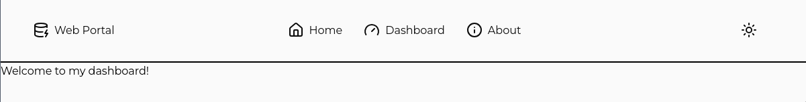

# 2.  - Prettier Skeleton

Now that we have our site skeleton, let's make it look a little more nice.
## Goal

By the end of this chapter, we will have learned the following:
 - How to add a custom font from Google Fonts.
 - How to prettify the NavBar.
   - How we can give it a logo and add the web portal title.
   - How to add some padding and place the links in the center.
   - How to move the light switch to the right.
 - How to add a margin to the content of the main section.
 - How to add some content to the Footer.
 - How to re-use data across components using [Stores](https://svelte.dev/docs/svelte/stores)

## 2.0 - Adding a Custom Font

We will be using the [Google Fonts](https://fonts.google.com/) service to add a custom font to our site. We will be using the "Montserrat" font.

1. Go to [Google Fonts](https://fonts.google.com/) and search for "Montserrat".
2. Grab the @import link from the "Embed" tab.
3. Add the @import link to the very top of your `app.css` file.
4. Add a custom [tailwind font family](https://tailwindcss.com/docs/font-family) to the `@theme` section of your `app.css` file.

    Your `src/app.css` file should look like this now:

    ```css
    @import url('https://fonts.googleapis.com/css2?family=Montserrat:ital,wght@0,100..900;1,100..900&display=swap');
    @import 'tailwindcss';

    @import '@skeletonlabs/skeleton';
    @import '@skeletonlabs/skeleton/optional/presets';
    @import '@skeletonlabs/skeleton/themes/cerberus';

    @custom-variant dark (&:where([data-mode=dark], [data-mode=dark] *));

    @source '../node_modules/@skeletonlabs/skeleton-svelte/dist';

    @theme {
        --font-montserrat: 'Montserrat';
    }
    ```
5. Use it as a class attribute on the `html` tag in your `src/app.html` file.

    ```html
    ...
    <html data-theme="vintage" lang="en" class="h-full font-montserrat">
    ...
    ```

If we now reload the server, we should see that the font has changed to Montserrat. If you don't see the change, try clearing the browser cache by shift-clicking the refresh button.

## 2.1 - Prettifying the NavBar
Let's give some basic styling to the NavBar to make it look a little more modern.

### 2.1.0 - Icons
Let's add a couple more icons: one for each of our pages, and one for the logo for our website. We'll refer to the `lucide-svelte` components in our `pages` array directly.

`/src/lib/components/ui/nav/NavBar.svelte`:

```html
<script lang="ts">
    ...
	import { DatabaseZap, House, Gauge, Info } from 'lucide-svelte';
    let pages = [
		{ name: 'Home', path: '/', icon: House },
		{ name: 'Dashboard', path: '/dashboard', icon: Gauge },
		{ name: 'About', path: '/about', icon: Info }
	];
    ...
</script>
```

Because svelte is awesome, we can now use `page.icon` as a dynamic attribute in our `each` loop (`/src/lib/components/ui/nav/NavBar.svelte`):

```html
...
<button type="button" on:click={() => goto(page.path)} class="btn preset-tonal-surface">
	<page.icon />
	{page.name}
</button>
...
```

Now let's add a logo section to our navbar, and wrap the `each` loop and `LightSwitch` component in divs (`/src/lib/components/ui/nav/NavBar.svelte`:):

```html
<nav class="h-24">
	<div class="">
		<button type="button" on:click={() => goto('/')} class="btn preset-tonal-surface">
			<span class="">
				<DatabaseZap />
				Web Portal
			</span>
		</button>
	</div>
	<div class="">
		{#each pages as page (page.name)}
			...
		{/each}
	</div>
	<div class="">
		<LightSwitch />
	</div>
</nav>
```

Finally, let's style it by creating a [3-column grid](https://tailwindcss.com/docs/grid-column), where our logo section, pages section, and `LightSwitch` have their own column, aligned at the start, center, and end respetively. Furthermore we apply some [padding](https://tailwindcss.com/docs/padding) and [margin](https://tailwindcss.com/docs/margin), [fixed heights](https://tailwindcss.com/docs/height), and [border color](https://tailwindcss.com/docs/border-color) to the navbar: 

Final `/src/lib/components/ui/nav/NavBar.svelte`:

```html
<nav class="border-fg grid h-24 grid-cols-3 items-center border-b-2 px-8">
	<div class="flex justify-start">
		<button type="button" on:click={() => goto('/')} class="btn preset-tonal-surface h-16 w-fit">
			<span class="flex gap-x-2">
				<DatabaseZap />
				Web Portal
			</span>
		</button>
	</div>
	<div class="flex justify-center">
		{#each pages as page (page.name)}
			<button type="button" on:click={() => goto(page.path)} class="btn preset-tonal-surface h-16">
				<page.icon />
				{page.name}
			</button>
		{/each}
	</div>
	<div class="flex justify-end">
		<LightSwitch />
	</div>
</nav>

```

And voila! We have a nice navbar with a logo, some links, and a light switch. 




## 2.2 - Adding some margin to the Main Section

Now that we have a nice navbar, let's add some margin to the main section.

We will make the content look more centered, but also make sure it doesn't get too wide on large screens. We can do this by calculating the minimum between 85% of the screen width and 100ch (which is 100 characters wide). Finally, we add some vertical padding to the main section. We've also added some color to the `div` here, so we can get a better look at the section which will render the main content. Feel free to remove this color upon finding width values that fit your design.

`/src/routes/+layout.svelte`:

```html
...
<main class="flex flex-grow justify-center py-4">
	<div class="max-w-[min(85%,100ch)] flex-grow bg-red-300">
		{@render children()}
	</div>
</main>
...
```


## 2.3 - Footer

### 2.3.0 - Creating the footer

First, let's extract the footer into it's own component, `src/lib/components/footer/Footer.svelte`.

Don't forget to import it in `src/routes/+layout.svelte`:

```html
<script lang="ts">
	import '../app.css';
	import NavBar from '$lib/components/ui/nav/NavBar.svelte';
	import Footer from '$lib/components/ui/footer/Footer.svelte';

	let { children } = $props();
</script>

<div class="flex min-h-screen flex-col">
	<NavBar />
	<main class="flex flex-grow justify-center py-4">
		<div class="max-w-[min(85%,100ch)] flex-grow bg-red-300">
			{@render children()}
		</div>
	</main>
	<Footer />
</div>

```

We'll create a simple Footer with a copyright section and a site map (`src/lib/components/footer/Footer.svelte`):

```html
<script lang="ts">
	let siteName = 'My Important Company';
	let currentYear = new Date().getFullYear();

	let pages = [
		{ name: 'Home', path: '/', icon: House },
		{ name: 'Dashboard', path: '/dashboard', icon: Gauge },
		{ name: 'About', path: '/about', icon: Info }
	);
</script>

<footer class="border-fg flex justify-center gap-x-16 border-t-2 py-2">
	<div class="flex flex-col items-start justify-center">
		<p class="text-fg text-center text-sm">
			&copy; {currentYear}
			{siteName}.
		</p>
		<p class="text-fg text-center text-sm">All rights reserved.</p>
	</div>
	<div class="flex flex-col items-start">
		<span class="font-bold">Site Map</span>
		{#each $pages as page (page.name)}
			<a href={page.path}>{page.name}</a>
		{/each}
	</div>
</footer>
```

Cool. Looks pretty decent:


You may have noticed however, that we are now duplicating our site map code!

### 2.3.1 - Cleaning up duplicate code by utilizing stores

To resolve this code duplication, we can extract the site map data into it's own navigation [store](https://svelte.dev/docs/svelte/stores). A _store_ is an object that allows reactive access to a value via a simple _store contract_.

We create a `/src/lib/stores/navigation.ts` file, and create a [readable store](https://svelte.dev/docs/svelte/stores#svelte-store-readable):

```typescript
import { readable } from 'svelte/store';
import { House, Gauge, Info } from 'lucide-svelte';

export const pages = readable([
	{ name: 'Home', path: '/', icon: House },
	{ name: 'Dashboard', path: '/dashboard', icon: Gauge },
	{ name: 'About', path: '/about', icon: Info }
]);
```

Now we import and use this store in our `NavBar` and `Footer` components. We can simply remove our `let pages` and replace them with an import now. Our `#each` block remains the same.

`/src/lib/components/ui/nav/NavBar.svelte:`

```html
<script lang="ts">
	...
	import { pages } from '$lib/stores/navigation';
	...
</script>
```

`/src/lib/components/ui/footer/Footer.svelte`:

```html
<script lang="ts">
    ...
	import { pages } from '$lib/stores/navigation';
	...
</script>
```


And that's it! We can now change the names of the pages in the store file (if we feel the need to), and see them update in both the `NavBar` and `Footer` components.

## 2.4 - Rounding up

Awesome. Our website is starting to look pretty decent.

In this chapter, we have learned how to:
 - Add a custom font from Google Fonts.
 - Prettify the NavBar.
   - Add a logo and title.
   - Center the links and add padding.
   - Move the light switch to the right.
 - Add some margin to the main section.
 - Create a footer with a copyright section and site map.
 - Re-use data across components using stores.

### Next

Before we continue styling the website any further, let's start shifting our focus to showing actual data in the dashboard. In the next chapter, we will set up [Drizzle](https://orm.drizzle.team/) as our Object Relational Mapper (ORM) to interact with our MySQL database. See [3-drizzle-orm](../3-drizzle-orm/3-drizzle-orm.md).


